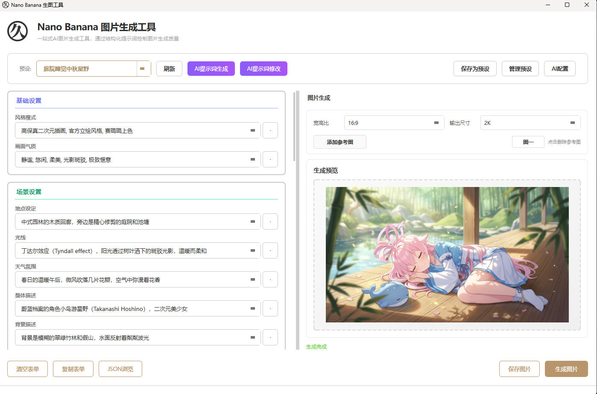
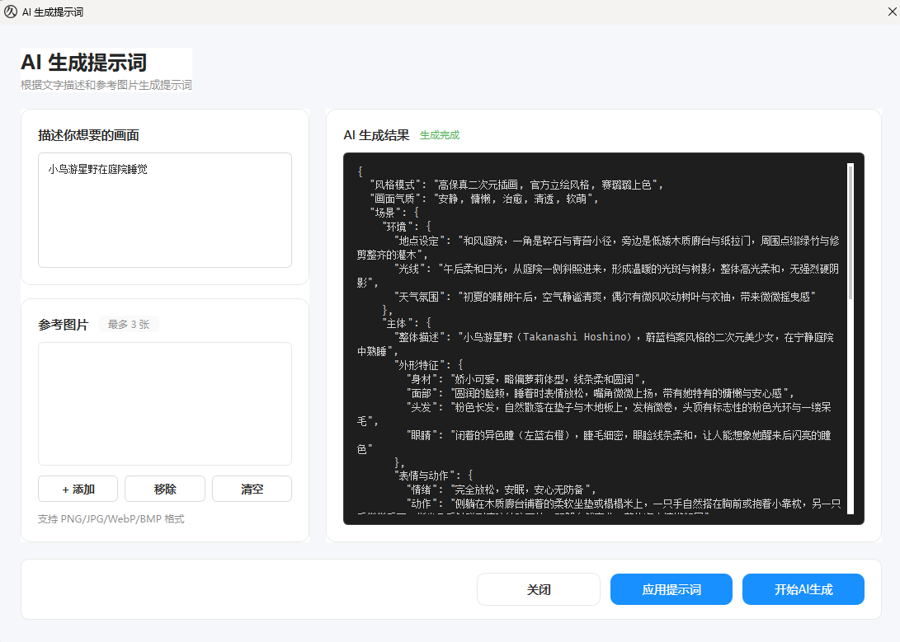
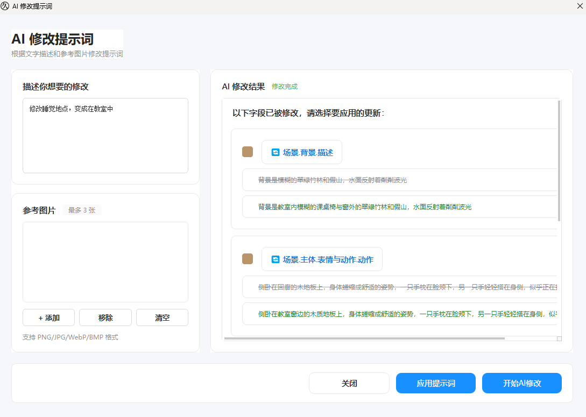
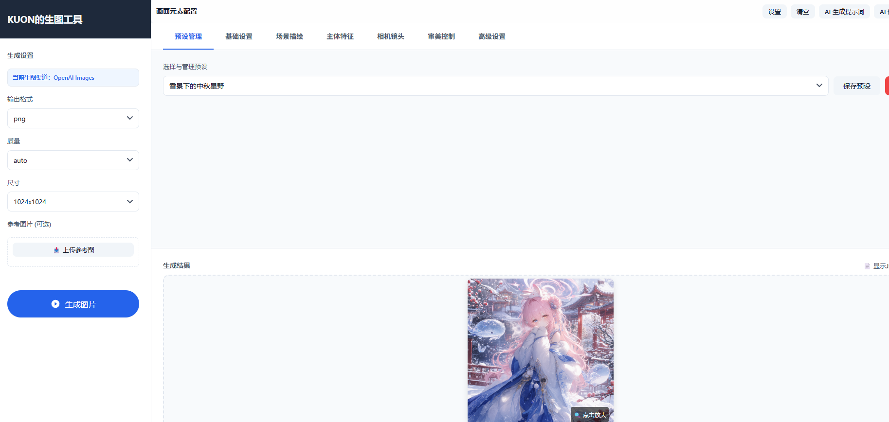

<p align="center">
  
</p>

<h1 align="center">Nano Banana Studio</h1>

<p align="center">
  <strong>一站式 AI 生图工作台，通过结构化提示词控制多渠道图片生成质量。</strong>
</p>

<p align="center">
  
  
  
  
  
  
</p>

---

## 1 功能特性

- **可视化编辑** - 表单化编辑提示词，方便针对特定元素进行修改。
- **AI 智能生成** - 一句话描述生成完整结构化提示词
- **AI 修改** - 一句话描述对已有提示词进行修改
- **预设管理** - 保存/加载/删除常用提示词配置
- **一键复制** - 快速复制 JSON 到剪贴板
- **图片生成** - 支持 Gemini 和 OpenAI Images（gpt-image-2）多渠道直接生成图片，宽高比/尺寸/质量参数按渠道独立配置

## 2 界面预览

* 主界面

----

* AI生成提示词界面

----

* AI修改提示词界面

----

* web界面

----


## 3 快速开始

### 3.1 下载客户端使用

在[Releases](https://github.com/lissettecarlr/nano-banana-prompt-studio/releases)页面下载最新客户端，目前只编译了`windows`版本，解压后双击运行。


### 3.2 web运行

```bash
cd src/web
pip install -r requirements.txt
python start.py

#或者docker运行
docker run --rm --name nano-banana-web -p 5000:5000 lissettecarlr/nano-banana-web:v0.1.9
```

### 3.3 通过代码运行

#### 环境要求

- Python 3.10+

#### 安装

```bash
# 克隆仓库
git clone https://github.com/your-username/nano-banana-prompt-studio.git
cd nano-banana-prompt-studio

# 安装依赖
pip install -r requirements.txt
```

#### 运行

```bash
cd src
python main.py
```

#### 打包
```bash
python build.py
```

## 4 使用说明

### 4.1 基础使用

1. 启动应用后，点击设置按钮，填入模型
2. 选择一个预设提示词
3. 指定图片的尺寸大小等，点击图片生成
4. 等待图片生成，尺寸越大越耗时

### 4.2 AI提示词生成

如果在设置中配置了`提示词生成模型`，那么可以通过描述，让AI来生成提示词。点击`AI生成提示词`进入子页面，可以输入描述和传入图片，来生成。点击「应用到表单」将生成的内容填充到编辑器。

### 4.3 AI提示词修改

如果在设置中配置了`提示词生成模型`，那么可以通过描述，让AI来对当前的提示词进行修改，点击`AI修改提示词`进入子页面，可以输入描述和传入图片，来修改，界面会展示出具体修改了哪些项，点击「应用到表单」将生成的内容填充到编辑器。

## 5 效果

**使用提示词的时候附带了角色图，更多生成图见[pixiv](https://www.pixiv.net/users/18200513)**

----

* 海边中秋星野（gemini-3.1-flash-image）


* 海边中秋星野（gpt-image-2）


----

* 庭院睡觉中秋星野（gemini-3.1-flash-image）


* 庭院睡觉中秋星野（gpt-image-2）


----

* 雪景下的中秋星野（gemini-3.1-flash-image）


* 雪景下的中秋星野（gpt-image-2）


----

* 阿拜多斯沙漠的中秋星野（gemini-3.1-flash-image）


----


